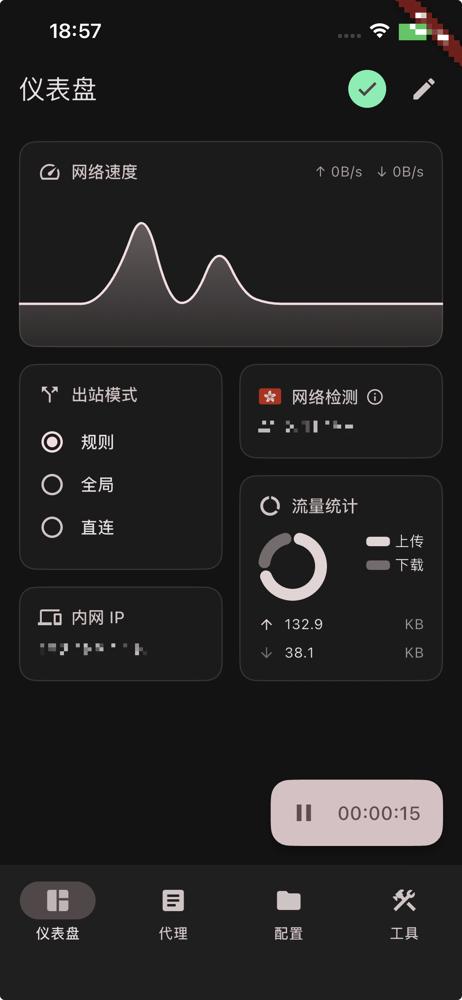

<div>

[**English**](README.md)

</div>

## FlClash

[](https://github.com/chen08209/FlClash/releases/)[](https://github.com/chen08209/FlClash/releases/)[](LICENSE)

[](https://t.me/FlClash)

基于ClashMeta的多平台代理客户端，简单易用，开源无广告。

on Desktop:
<p style="text-align: center;">
    
</p>

on Mobile:
<p style="text-align: center;">
    
</p>

on iOS:
<p style="text-align: center;">
    
</p>

## Features

✈️ 多平台: Android、iOS、Windows、macOS 和 Linux

💻 自适应多个屏幕尺寸,多种颜色主题可供选择

💡 基本 Material You 设计, 类[Surfboard](https://github.com/getsurfboard/surfboard)用户界面

☁️ 支持通过WebDAV同步数据

✨ 支持一键导入订阅, 深色模式

## Use

### Linux

⚠️ 使用前请确保安装以下依赖

   ```bash
    sudo apt-get install libayatana-appindicator3-dev
    sudo apt-get install libkeybinder-3.0-dev
   ```

### Android

支持下列操作

   ```bash
    com.follow.clash.action.START
    
    com.follow.clash.action.STOP
    
    com.follow.clash.action.TOGGLE
   ```

## Download

<a href="https://chen08209.github.io/FlClash-fdroid-repo/repo?fingerprint=789D6D32668712EF7672F9E58DEEB15FBD6DCEEC5AE7A4371EA72F2AAE8A12FD"></a> <a href="https://github.com/chen08209/FlClash/releases"></a>

## Build

1. 更新 submodules
   ```bash
   git submodule update --init --recursive
   ```

2. 安装 `Flutter` 以及 `Golang` 环境

3. 构建应用

    - android

        1. 安装  `Android SDK` ,  `Android NDK`

        2. 设置 `ANDROID_NDK` 环境变量

        3. 运行构建脚本

           ```bash
           dart .\setup.dart android
           ```

    - windows

        1. 你需要一个windows客户端

        2. 安装 `Gcc`，`Inno Setup`

        3. 运行构建脚本

           ```bash
           dart .\setup.dart windows --arch <arm64 | amd64>
           ```

    - linux

        1. 你需要一个linux客户端

        2. 运行构建脚本

           ```bash
           dart .\setup.dart linux --arch <arm64 | amd64>
           ```

    - macOS

        1. 你需要一个macOS客户端

        2. 运行构建脚本

           ```bash
           dart .\setup.dart macos --arch <arm64 | amd64>
           ```

    - iOS

        1. 使用安装了 Xcode、Go 和 CocoaPods 的 macOS，并在 Xcode 中登录你的 Apple
           开发者账号

        2. 把签名相关标识换成你自己的 —— 仓库里的标识属于上游开发者，其他人无法使用：

           - 打开 `ios/Runner.xcworkspace`，为 **Runner** 和 **PacketTunnel**
             两个 target 设置你自己的 Team 与 Bundle Identifier

           - 为两个 target 添加 **App Groups** 能力（使用你自己的组，例如 `group.` +
             你的 Bundle Identifier）和 **Network Extensions** 能力（勾选
             **Packet Tunnel Provider**）

           - App Group 字符串需在所有位置保持一致：`ios/Runner/Runner.entitlements`、
             `ios/PacketTunnel/PacketTunnel.entitlements`、
             `ios/Runner/AppDelegate.swift`、
             `ios/PacketTunnel/PacketTunnelProvider.swift`；并把
             `ios/Runner/AppDelegate.swift` 里的 packet tunnel provider bundle
             identifier 改成与 PacketTunnel 的 Bundle Identifier 一致

        3. 构建 iOS 核心与应用

           ```bash
           dart ./setup.dart ios
           ```

        4. 安装到设备：用 Xcode 打开 `ios/Runner.xcworkspace`，选择你的设备后 Run

## Star History

支持开发者的最简单方式是点击页面顶部的星标（⭐）。

<p style="text-align: center;">
    <a href="https://api.star-history.com/svg?repos=chen08209/FlClash&Date">
        
    </a>
</p>
